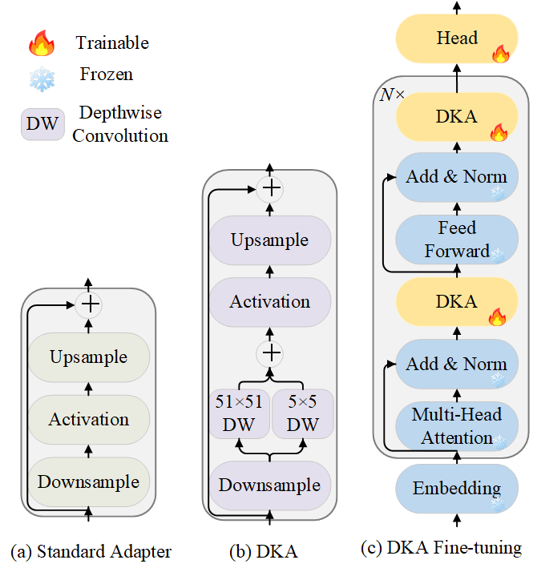

# Dual-Kernel Adapter: Expanding Spatial Horizons for Data-Constrained Medical Image Analysis 

[ICLR2026] ["Dual-Kernel Adapter: Expanding Spatial Horizons for Data-Constrained Medical Image Analysis"]

Adapters have become a widely adopted strategy for efficient fine-tuning of large pretrained models, particularly in resource-constrained settings. However, their performance under extreme data scarcity—common in medical imaging due to high annotation costs, privacy regulations, and fragmented datasets—remains underexplored. In this work, we present the first comprehensive study of adapter-based fine-tuning for large pretrained models in low-data medical imaging scenarios. We find that, contrary to their promise, conventional Adapters can degrade performance under severe data constraints, performing even worse than simple linear probing when trained on less than 1% of the corresponding training data. Through systematic analysis, we identify a sharp reduction in Effective Receptive Field (ERF) as a key factor behind this degradation. Motivated by these findings, we propose the Dual-Kernel Adapter (DKA), a lightweight module that expands spatial context via large-kernel convolutions while preserving local detail with small-kernel counterparts. Extensive experiments across diverse classification and segmentation benchmarks show that DKA significantly outperforms existing Adapter methods, establishing new leading results in both data-constrained and data-rich regimes.

## What is in this repository?

We provide the training code for our DKA method and the baselines.

## Dependencies

Run `pip3 install -r requirements.txt`.

## Datasets

You can download or use your own datasets in Folder `data`

For example, you can prepare BUSI dataset by py `python data/busi_cross_validation`

You need to chage the file location (eg., `data_dir`, `output_dir` ) based on your environment.

For datasets, you can download in Kaggle or Github.

## Training

**DKA:**

Backbone: ViT: `python experiments/cnn/adapter_tuning_dka --network vit_b16_adapter --dataset BUSI`

Backbone: Swin: `python experiments/cnn/adapter_tuning_dka --network swin_base_adapter  --dataset BUSI`

You need chage the dataset location based on your setting.

**Other Baselines:**

Linear probing: `python experiments/cnn/linear_probing_cross_validation.py  --network swin_base --dataset BUSI`

Full finetune: `python experiments/cnn/full_finetune_cross_validation.py --network vit_b16 --dataset BUSI`

Lora: `python experiments/cnn/lora_tuning.py --network vit_b16_lora --dataset BUSI --rank 4`

Prompt: `python experiments/cnn/prompt_tuning.py --network vit_b16_prompt --dataset BUSI`

## Citation

